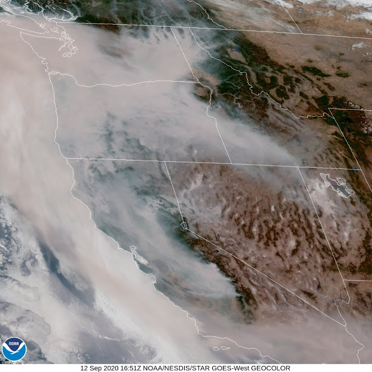
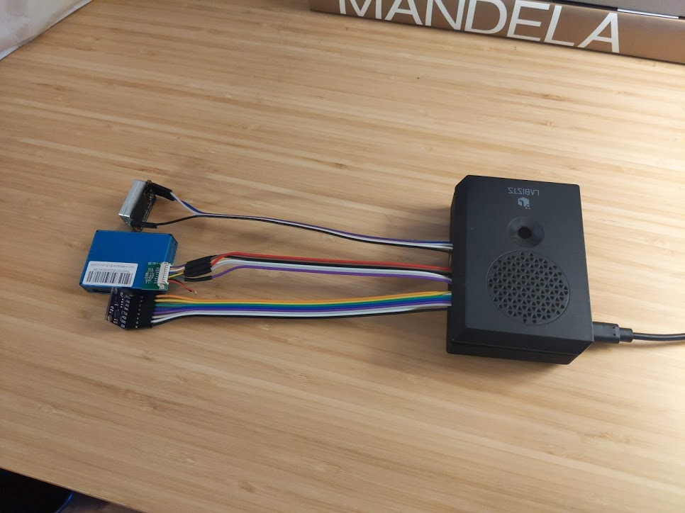
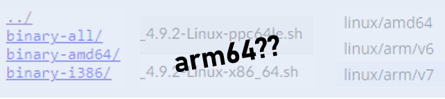

# Air Quality Monitoring

- [Air Quality Monitoring](#air-quality-monitoring)
  - [IoT Analytics](#iot-analytics)
    - [My IoT Analytics Stack](#my-iot-analytics-stack)
      - [Database: TimescaleDB](#database-timescaledb)
      - [Message Broker: None](#message-broker-none)
      - [Ad-hoc Queries: Grafana and others](#ad-hoc-queries-grafana-and-others)
      - [Data Visualization: Grafana](#data-visualization-grafana)
  - [The Code](#the-code)
- [What I Learned](#what-i-learned)
  - [Linux aarch64 support is still developing](#linux-aarch64-support-is-still-developing)
  - [Sensor hardware is surprisingly configurable - a double-edged sword for data consumers](#sensor-hardware-is-surprisingly-configurable---a-double-edged-sword-for-data-consumers)
  - [Sensors themselves do edge computing](#sensors-themselves-do-edge-computing)
  - [There are bias-variance tradeoffs in measurement itself](#there-are-bias-variance-tradeoffs-in-measurement-itself)
  - [TimescaleDB is nifty for time series (surprise!)](#timescaledb-is-nifty-for-time-series-surprise)

The west coast wildfire season prompts a lot of data reporting on outdoor air quality. Sensor networks like [purpleair.com](purpleair.com) provide impressive maps of outdoor air quality from local to continental scales. During these oppressive smoke events, health advocates advise to stay indoors. But how much better is indoor air quality? And what are the impacts of indoor activities like cooking, vacuuming, and just... breathing?

To answer these questions, I decided to set up sensors and log data.

## IoT Analytics

Distributed measurement and analytics falls under the "Internet of Things" (IoT) paradigm. IoT networks consist of many sensor devices, each reporting measurements back to a local gateway node (or series of nodes) en route to a central database. Processing and aggregation of this data can take place centrally or also on the gateway devices at the 'edge' of the network in what is termed 'edge computing'.

### My IoT Analytics Stack

A typical IoT stack consists of a time series database, a message broker to handle communication between sensors and the database, an ad-hoc query engine for analytics, and a data visualization tool for monitoring and analysis.

#### Database: TimescaleDB

TimescaleDB is an open source PostgreSQL extension that brings a suite of time series specific features and functionality to an established and reliable database. The primary architectural change vs vanilla PostgreSQL is the use of 'hypertables' (a partition and indexing schema) to store time series data. This essentially means time series are stored in row-order on and near ingestion time, then are later automatically converted to column-order. This 'best of both worlds' approach leverages the relative strengths of row- vs column-order storage to match the needs of time series workflows.

Specifically, ingestion and condition monitoring focus on only the last chunk of records, but span the full column space, and thus benefit from row-ordered storage. Later on, analytics workloads dominate, which are commonly column focused ("what was the average cpu usage of datacenter 3 last March?"). Additionally, old data is usually accessed less frequently, making it a good candiate for data compression. Compression is another use case where column ordering is advantageous, because autocorrelation is usually much stronger within a column than across a row.

Another leading time series database is InfluxDB, a No-SQL, tag-based data store. It uses a domain specific language called Flux to query data. I chose TimescaleDB primarily to reduce training costs, thanks to its familiar RDBMS foundation and full SQL support.

#### Message Broker: None

The most common IoT message protocol is MQTT, which uses a publish-subscribe model with persistent connections. Compared to an intermittant connection protocol like HTTP, MQTT spends more resources opening and closing a connection, but each transmitted message has far less overhead. MQTT is therefore preferable to HTTP when connections can be reused and data payloads contain multiple fields.

These conditions are common in IoT applications, where devices read multiple sensors and report data every few seconds. Under these circumstances, MQTT delivers lower latency, lower bandwidth usage, and lower power consumption. All the major cloud providers offer MQTT-based products.

This particular project benefits from a central server (Raspberry Pi) that directly connects to sensor hardware, so the transport layer can be removed.

#### Ad-hoc Queries: Grafana and others

Thanks to the ubiquity of PostgreSQL, there are many ways to query the database. There are CLI options like psql and web apps like pgAdmin. The data visualization tool Grafana (see below) also has ad hoc query support. These are all well supported, open source tools.

#### Data Visualization: Grafana

Grafana is a dashboarding tool that can connect to a wide array of data sources, including TimescaleDB. The dashboards are fully responsive and look nice on phone, tablet, and computer screens.

Out of the box, Grafana's charts are limited to single dimensional plots best suited to simple monitoring tasks rather than sophisticated analytics. But there are many community plugins to extend Grafana's functionality.

## The Code

This project consists of four parts:

1. Hardware drivers for 5 air quality sensors, in ./sensors/
2. Data logging to the TimescaleDB database, in ./sampling_script.py
3. systemd unit to start everything on boot and restart on failure, in ./data_logger.service
4. Installation and configuration of all these parts, in ./makefile

This setup runs on a Raspberry Pi 4 running Ubuntu 20.04 (aarch64/arm64).

# What I Learned

## Linux aarch64 support is still developing

Linux aarch64 (aka arm64) might be the future, but it certainly isn't the present, at least in this sofware ecosystem. Dependency management on aarch64 was a pain point because most software is not available pre-built for this architecture, so I had to build from source or find alternatives. Basic stuff like PgAdmin, TimescaleDB, and Anaconda were not available through apt or PPAs. Pip installing python libraries was slow for the same reason: few binary wheels were pre-built for aarch64, so they had to build at install time. Some builds failed until I found the right compilers.

This wasn't a deal-breaker but I wouldn't use aarch64 again without a compelling reason to do so, at least until ARM market share grows and support improves.

## Sensor hardware is surprisingly configurable - a double-edged sword for data consumers

Configurability is a double-edged sword because the same sensor model can output very different measurement values, depending on configuration. Are users aware of this?

Sensor configuration must be documented at a minimum, and preferably included in the user feedback process.

## Sensors themselves do edge computing

Perhaps naively, I thought reading a pressure sensor returned a single pressure measurement. But actually sensors can perform a surprising amount of post-processing on-chip. For example, my pressure sensor can aggregate up to 16 individual measurements in each reported value, or blend multiple measurements together with an IIR smoothing filter.

Like all edge computing, this processing power can deliver greater value per bandwidth and per storage, but risks erasing key information by aggregating too early.

## There are bias-variance tradeoffs in measurement itself

I know metrology (the study of measurement) is a whole discipline, but I thought that when it came to individual sensors, all that complexity was already managed (or not) at the hardware level. I thought my only decision was to choose which device with which specs to buy. Not so. Take my resistive temperature sensor as an example.

I can change the reported measurements from my temperature sensor by 0.2 °C just by changing the sampling frequency. Maybe that is irrelevant for your application, or maybe it is critical. But it is up to the user both to figure this out and to design accordingly.

[An aside on the physics of why this happens: the sensor contains a resistor whose resistance changes with temperature in a known way. By passing current through that resistor and measuring the resistance, the sensor can calculate temperature. But there is a problem here: passing current through a resistor produces heat. Thus the act of measurement changes the temperature of the thing being measured! Again, I thought this complexity was accounted for by the OEM, whether in device design or calibration factors or something. And I'm sure it is to some extent. But not entirely!]

The temperature sensor I used gives you the option of oversampling - taking the average of a burst of up to 16 measurements over a few milliseconds. This reduces variance by averaging out random fluctuations. But it increases bias by dumping 16x more heat into the sensor, producing the aforementioned 0.2 °C temp rise. Which option do the end users of the data prefer?

## TimescaleDB is nifty for time series (surprise!)

An extension of PostgreSQL, TimescaleDB gives data engineers a chance to simplify their tooling by putting time series data in the same RDBMS as regular relational data, scale permitting. The extension is enabled per-database, and specific features enabled per table, allowing a nice compartmentalization. I found it integrated seamlessly with Postgres tooling like PgAdmin4, Grafana, and psycopg2.

Timescale also has some built in functionality to make working with time series more convenient and maintainable vs vanilla SQL. For example, tables can be configured with scheduled (time-to-live) aggregation and/or compression, and queries come with built-in time functions like rolling averages, deltas, and binning. The query functionality was fully-featured enough to keep me working in SQL instead of reverting to my comfort zone of the pandas python library.
